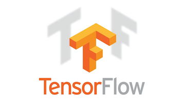

# Neural Networks Introduction

------------------

In this chapter, we will introduce neural networks and how to implement them in TensorFlow. Most of the subsequent chapters will be based on neural networks, so learning how to use them in TensorFlow is very important. We will start by introducing the basic concepts of neural networking before working up to multilayer networks. In the last section, we will create a neural network that will learn how to play Tic Tac Toe.

In this chapter, we'll cover the following recipes:

- Implementing operational gates
- Working with gates and activation functions
- Implementing a one-layer neural network
- Implementing different layers
- Using multilayer networks
- Improving predictions of linear models
- Learning to play Tic Tac Toe

----------------
Neural networks are currently breaking records in tasks such as image and speech recognition, reading handwriting, understanding text, image segmentation, dialog systems, autonomous car driving, and so much more. While some of these aforementioned tasks will be covered in later chapters, it is important to introduce neural networks as an easy-to-implement machine learning algorithm, so that we can expand on it later.

The concept of a neural network has been around for decades. However, it only recently gained traction because we now have the computational power to train large networks because of advances in processing power, algorithm efficiency, and data sizes.

A neural network is basically a sequence of operations applied to a matrix of input data. These operations are usually collections of additions and multiplications followed by the application of non-linear functions. One example that we have already seen is logistic regression, which we looked at in Chapter 4, Linear Regression. Logistic regression is the sum of partial slope-feature products followed by the application of the sigmoid function, which is non-linear. Neural networks generalize this a bit more by allowing any combination of operations and non-linear functions, which includes the application of absolute value, maximum, minimum, and so on.

The important trick with neural networks is called back propagation. Back propagation is a procedure that allows us to update model variables based on the learning rate and the output of the loss function. We used back propagation to update our model variables in Chapter 3, Keras, and Chapter 4, Linear Regression.

Another important feature to take note of regarding neural networks is the non-linear activation function. Since most neural networks are just combinations of addition and multiplication operations, they will not be able to model non-linear data sets. To address this issue, we have used non-linear activation functions in our neural networks. This will allow the neural network to adapt to most non-linear situations.

It is important to remember that, as we have seen in many of the algorithms covered, neural networks are sensitive to the hyper-parameters we choose. In this chapter, we will explore the impact of different learning rates, loss functions, and optimization procedures.

There are more resources for learning about neural networks that are more in depth and detailed. Here are some following resources:

- The seminal paper describing back propagation is Efficient Back Prop by Yann LeCun et. al. The PDF is located here: http://yann.lecun.com/exdb/publis/pdf/lecun-98b.pdf

- CS231, Convolutional Neural Networks for Visual Recognition, by Stanford University, class resources available here: http://cs231n.stanford.edu/

- CS224d, Deep Learning for Natural Language Processing, by Stanford University, class resources available here: http://cs224d.stanford.edu/

- Deep Learning, a book by the MIT Press. Goodfellow, et. al. 2016. Located: http://www.deeplearningbook.org

- There is an online book called Neural Networks and Deep Learning by Michael Nielsen, located here: http://neuralnetworksanddeeplearning.com/

- For a more pragmatic approach and introduction to neural networks, Andrej Karpathy has written a great summary and JavaScript examples called A Hacker's Guide to Neural Networks. The write up is located here: http://karpathy.github.io/neuralnets/

- Another site that summarizes some good notes on deep learning is called Deep Learning for Beginners by Ian Goodfellow, Yoshua Bengio, and Aaron Courville. This web page can be found here: http://randomekek.github.io/deep/deeplearning.html
